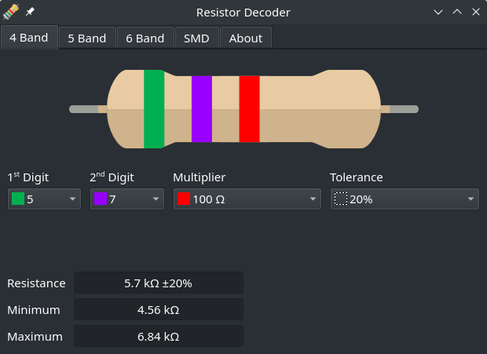
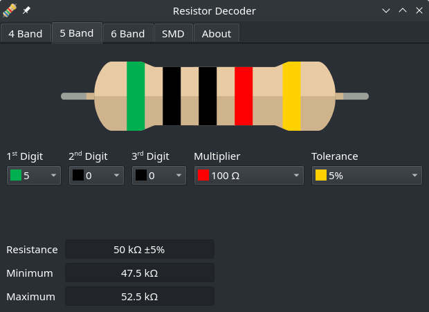
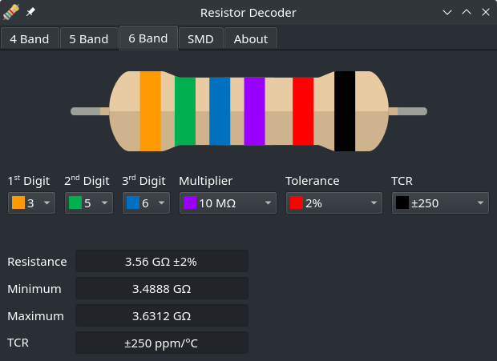
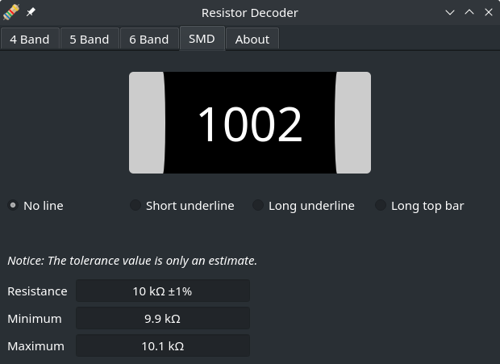

# Resistor Color and SMD Decoder

This is a standalone Qt GUI tool for color bands on through-hole resistors and number codes on SMD parts.
It supports 3, 4, 5, and 6 band resistors, as well as standard SMD codes, including the EIA-96 standard.

| 3 or 4 Bands | 5 Bands |
|:------------:|:-------:|
|||
| 6 Bands | SMD |
|||

## Features
- Decode the resistance and tolerance, as well as the Temperature Coefficient of Resistance (for 6 band resistors).
- Can parse SMD codes¹, including the EIA-96 standard.
- Respects your system's Qt theming.

## Dependencies
PySide6

```
pip install PySide6
```

## Installation
This program is available as an AUR package, or Windows executable.\
Alternatively, install and run from source:

```
git clone https://github.com/VoxelCubes/Resistor-Color-and-SMD-Decoder
cd Resistor-Color-and-SMD-Decoder
python main.py
```

## Notes
1. Tolerance values are only standardized for EIA-96 codes and codes with short underlines. Check the manufacturer's datasheet if the tolerance is critical for your application.
